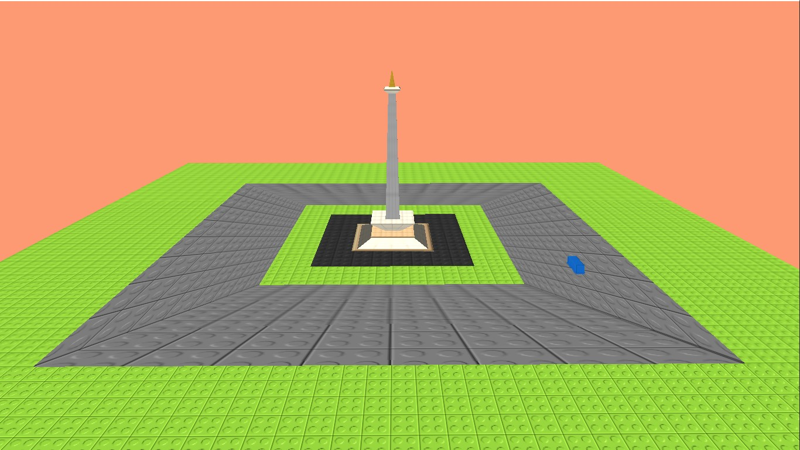

# MonasOpenGL
Monas tower and its scenery using opengl

Project ini dikembangkan oleh: 

Adya Farasadi     - 175150200111011 

Hutomo Ardianto   - 175150200111010  

M. Isrofil D. K.  - 175150207111046 

Dani Kurnianto    - 175150207111047 

Panorama atau scenery pemodelan Monas (Monumen Nasional) bertemakan lego menggunakan OpenGL

Watch our demo here:

